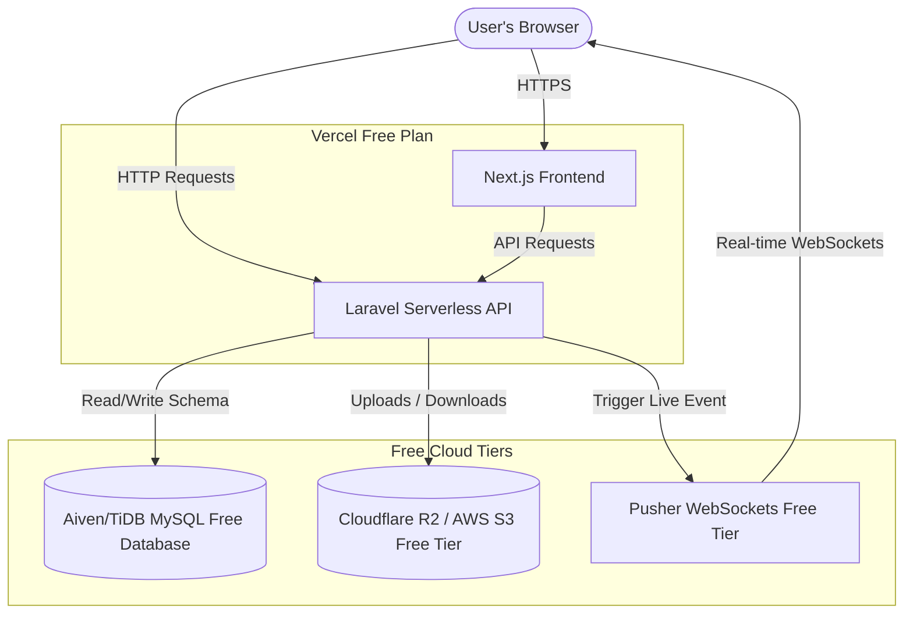

# Production Deployment Guide: Vercel Free Plan Only

This guide details how to deploy both the **Next.js frontend** and the **Laravel API backend** on the **Vercel Free (Hobby) Plan**. 

Because Vercel is a serverless platform, the Free Plan imposes strict limits on request sizes, runtimes, execution durations, and storage. Below are the required code modifications and configuration steps to successfully run the entire system for free.

---

## 1. Vercel Free Plan Architecture

On the Vercel Free Plan, both the frontend and backend run as serverless applications. Persistent containers are not supported, meaning background processes (like queue worker daemons) cannot run. All files are stored in external free cloud services.



---

## 2. Vercel Free Plan Limits & Required Code Workarounds

To deploy the application on the Free Plan, you **must** address the following platform limits:

### Limit 1: 4.5 MB Request Body Limit (Uploads)
*   **The Constraint**: Vercel Free Plan limits the payload size of any serverless function request to **4.5 MB**. 
*   **The Issue**: The frontend uploads files in chunks of 5MB by default. Standard uploads or chunked uploads larger than 4.5MB will result in a `413 Payload Too Large` error from Vercel's gateway.
*   **The Workaround**: 
    You must modify the chunk size in the frontend code to be smaller than 4.5MB. Update the `CHUNK_SIZE` in [TaskDetailsModal.tsx](file:///c:/laragon/www/test-trans-cosmos/frontend/src/components/TaskDetailsModal.tsx#L63):
    ```typescript
    // frontend/src/components/TaskDetailsModal.tsx - Line 63
    - const CHUNK_SIZE = 5 * 1024 * 1024; // 5MB chunks (Will fail on Vercel Free)
    + const CHUNK_SIZE = 2 * 1024 * 1024; // 2MB chunks (Safely fits under Vercel's 4.5MB limit)
    ```

### Limit 2: Ephemeral & Read-Only Filesystem
*   **The Constraint**: Vercel serverless environments are stateless and read-only, except for the ephemeral `/tmp` directory. Furthermore, separate HTTP requests are routed to different serverless container instances.
*   **The Issue**: In [AttachmentController.php](file:///c:/laragon/www/test-trans-cosmos/backend/app/Http/Controllers/AttachmentController.php), files and temporary chunks are uploaded to the hardcoded `local` disk, which resolves to local storage on the server:
    *   `$file->storeAs($tempPath, $chunkName, 'local');`
    *   `Storage::disk('local')->path(...)`
    Because the storage is ephemeral, chunks uploaded from different requests will hit separate instances and fail to merge.
*   **The Workaround**:
    For the Vercel Free Plan, you must override Laravel's default `local` disk configuration to write to `/tmp` (which is writable in serverless) or configure an S3-compatible cloud driver (like Cloudflare R2 or AWS S3 Free tier) as the active disk. 
    1. In `backend/config/filesystems.php`, redirect the `local` driver root to `/tmp` if running in Vercel:
        ```php
        // backend/config/filesystems.php
        'local' => [
            'driver' => 'local',
            'root' => env('VERCEL') ? '/tmp' : storage_path('app/private'),
            ...
        ],
        ```
    2. Since `/tmp` is still ephemeral and not shared between separate serverless instances, large chunked uploads may fail if chunks land on different serverless functions. For a robust Vercel Free Plan setup, it is recommended to adjust the frontend to upload files **directly to AWS S3/Cloudflare R2** from the browser via pre-signed URLs, bypassing Vercel completely.

### Limit 3: 10-Second Function Timeout
*   **The Constraint**: Vercel serverless functions on the Free plan have a strict **10-second execution limit**. Any request taking longer than 10 seconds will fail with a `504 Gateway Timeout`.
*   **The Issue**: 
    1. Server-Sent Events (SSE) opens a persistent connection. The route `/api/realtime/stream` will be terminated by Vercel every 10 seconds.
    2. Merging chunks, thumbnail generation, and simulated malware scanning must complete within 10 seconds.
*   **The Workaround**:
    1. **Real-time Synchronization**: Because SSE drops every 10 seconds on the Free Plan, you should either:
       *   Rely on client-side polling: Fetch tasks every 5-10 seconds using standard `fetch` requests.
       *   Swap the SSE system out for a WebSocket service with a free tier, such as **Pusher Channels Free Tier** (which provides 200,000 free messages/day).
    2. **Asset Processing**: Ensure file merging is fast (keep chunks small, e.g., 2MB) so that reassembly completes well under 10 seconds.

### Limit 4: No Background Daemon Workers
*   **The Constraint**: You cannot run `php artisan queue:work` continuously on Vercel Free Plan.
*   **The Workaround**:
    Configure Laravel to run queue jobs synchronously:
    ```env
    QUEUE_CONNECTION=sync
    ```
    This processes tasks (sending notification emails, simulating virus scans, and generating thumbnails) immediately during the HTTP request. Because the operations are simulated and fast, they will execute within the 10-second gateway limit.

---

## 3. Step-by-Step Vercel Free Plan Deployment

To deploy both apps for free, deploy them as two separate Vercel projects.

### Step 3.1: Deploy Next.js Frontend

1. Go to the [Vercel Dashboard](https://vercel.com) and click **Add New** > **Project**.
2. Select your imported repository.
3. Configure the following fields:
   - **Project Name**: `taskgrid-frontend`
   - **Framework Preset**: Select **Next.js**.
   - **Root Directory**: Select `frontend`.
4. Under **Environment Variables**, add:
   *   `NEXT_PUBLIC_API_URL`: Set to your backend Vercel URL (e.g., `https://taskgrid-backend.vercel.app/api`).
5. Click **Deploy**.

---

### Step 3.2: Deploy Laravel Backend

To run Laravel on Vercel's Serverless environment, we deploy using the community Vercel PHP runtime.

#### 1. Create `vercel.json`
Create a `vercel.json` file in the root of your project:

```json
{
  "version": 2,
  "name": "taskgrid-backend",
  "builds": [
    {
      "src": "backend/public/index.php",
      "use": "vercel-php@0.7.2"
    }
  ],
  "routes": [
    {
      "src": "/api/(.*)",
      "dest": "backend/public/index.php"
    },
    {
      "src": "/storage/(.*)",
      "dest": "backend/public/index.php"
    },
    {
      "src": "/(.*)",
      "dest": "backend/public/index.php"
    }
  ]
}
```

#### 2. Setup Vercel Project
1. Go to the [Vercel Dashboard](https://vercel.com) and click **Add New** > **Project**.
2. Select your repository.
3. Configure the following fields:
   - **Project Name**: `taskgrid-backend`
   - **Framework Preset**: Select **Other**.
   - **Root Directory**: Select `backend` (or keep root if utilizing a monorepo setup with `vercel.json`).
4. Add the required **Backend Environment Variables** (see Section 5).
5. Click **Deploy**.
6. After deploying, run migrations on your cloud database using a local terminal pointing to the remote DB, or temporarily trigger a custom endpoint on Vercel that runs:
   ```php
   Artisan::call('migrate --force');
   ```

---

## 4. Setup Free Cloud Infrastructure

You must use free cloud tiers for database and object storage as Vercel does not provide MySQL hosting or local disk persistence.

### 1. Database: Aiven MySQL Free Tier
Aiven offers a fully managed MySQL instance with a 100% free tier.
1. Sign up on [Aiven.io](https://aiven.io).
2. Create a **MySQL** database on the Free tier.
3. In the database dashboard, download the SSL CA Certificate if required.
4. Add connection details to Vercel's Environment Variables (`DB_HOST`, `DB_PORT`, `DB_DATABASE`, `DB_USERNAME`, `DB_PASSWORD`).

### 2. File Storage: Cloudflare R2 Free Plan
Cloudflare R2 provides an AWS S3-compatible API and offers **10 GB** of free storage per month with zero egress fees.
1. Sign up on [Cloudflare](https://cloudflare.com).
2. Go to R2 Storage and create a bucket named `taskgrid-attachments`.
3. Generate R2 Client Credentials (Access Key ID and Secret Access Key).
4. Configure these variables on the backend project:
   ```env
   FILESYSTEM_DISK=s3
   AWS_ACCESS_KEY_ID=your_r2_access_key
   AWS_SECRET_ACCESS_KEY=your_r2_secret_key
   AWS_DEFAULT_REGION=us-east-1
   AWS_BUCKET=taskgrid-attachments
   AWS_ENDPOINT=https://your-cloudflare-account-id.r2.cloudflarestorage.com
   AWS_USE_PATH_STYLE_ENDPOINT=true
   ```

---

## 5. Environment Variables Cheat Sheet (Vercel Free Plan)

### Frontend Environment Variables
Configure this in the `taskgrid-frontend` project:
| Key | Example Value | Description |
| :--- | :--- | :--- |
| `NEXT_PUBLIC_API_URL` | `https://taskgrid-backend.vercel.app/api` | The URL of your Vercel-hosted backend. |

### Backend Environment Variables
Configure these in the `taskgrid-backend` project:
| Key | Recommended Value | Description |
| :--- | :--- | :--- |
| `APP_NAME` | `TaskGrid` | App name. |
| `APP_ENV` | `production` | Production mode. |
| `APP_KEY` | `base64:xxxxxxx...` | Encryption key (Generate locally and paste). |
| `APP_DEBUG` | `false` | Must be `false` on the Free Plan. |
| `APP_URL` | `https://taskgrid-backend.vercel.app` | The backend Vercel URL. |
| `VERCEL` | `1` | Informs Laravel that it is running in Vercel. |
| `DB_CONNECTION` | `mysql` | MySQL database driver. |
| `DB_HOST` | `mysql-xxxxx.aivencloud.com` | Hostname from Aiven/TiDB. |
| `DB_PORT` | `12345` | Port from Aiven/TiDB. |
| `DB_DATABASE` | `defaultdb` | Database name. |
| `DB_USERNAME` | `avnadmin` | Database username. |
| `DB_PASSWORD` | `********` | Database password. |
| `JWT_SECRET` | `your-secret-jwt-key` | Secret key for custom JWT. |
| `FILESYSTEM_DISK` | `s3` | Bypasses ephemeral local storage. |
| `AWS_ACCESS_KEY_ID` | `xxxxxxxxxxx` | Access Key from Cloudflare R2 / S3. |
| `AWS_SECRET_ACCESS_KEY` | `xxxxxxxxxxx` | Secret Key from Cloudflare R2 / S3. |
| `AWS_DEFAULT_REGION` | `us-east-1` | S3 Region. |
| `AWS_BUCKET` | `taskgrid-attachments` | S3 bucket name. |
| `AWS_ENDPOINT` | `https://xx.r2.cloudflarestorage.com` | Endpoint for R2. |
| `AWS_USE_PATH_STYLE_ENDPOINT`| `true` | Required for R2 setup. |
| `QUEUE_CONNECTION` | `sync` | Required on Free Plan (no background worker daemon). |
| `ALLOWED_ORIGINS` | `https://taskgrid-frontend.vercel.app` | URL of the frontend project to bypass CORS blocks. |

---

## 6. Verification & Troubleshooting on Vercel Free Plan

### 1. Gateway Timeouts (504 Error)
*   **Symptom**: Requests fail with a 504 Gateway Timeout.
*   **Explanation**: The serverless execution exceeded the strict **10-second timeout** of the Vercel Free Plan.
*   **Resolution**: Reduce processing workloads (keep chunks small) or confirm the mailer is set to a fast driver (`log` or a fast external API like Mailgun) rather than standard SMTP which can hang.

### 2. Large File Uploads Fails (413 Payload Too Large)
*   **Symptom**: Attempts to upload files fail immediately.
*   **Explanation**: A chunk or file larger than Vercel's **4.5 MB request body limit** was sent.
*   **Resolution**: Double check that `CHUNK_SIZE` in the frontend code is set to `2 * 1024 * 1024` (2MB).

### 3. ephemerality / Merging Error
*   **Symptom**: Merging of chunked files fails, or files disappear after a few minutes.
*   **Explanation**: Ephemeral storage on Vercel was cleaned up, or different chunks were routed to separate serverless instances.
*   **Resolution**: Keep chunks small, and ensure that the backend paths resolve to `/tmp` locally for short merging phases, or migrate `AttachmentController` code to write direct chunk uploads directly to cloud storage.
